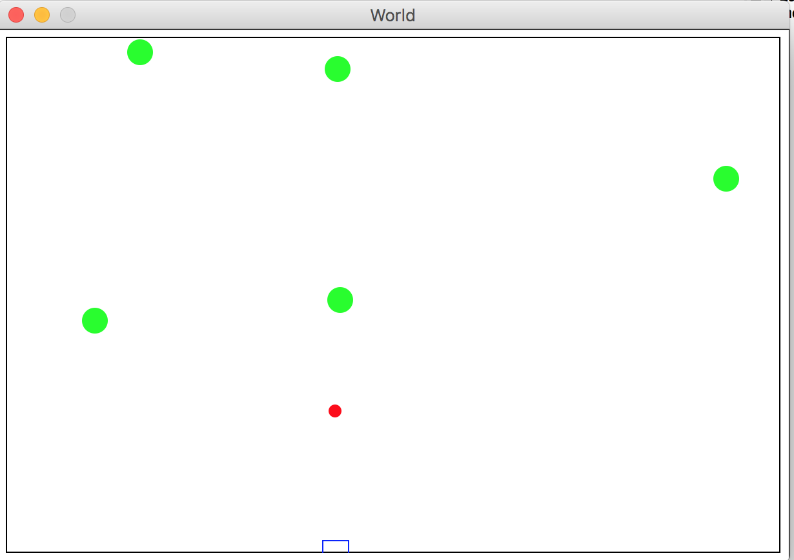

# Intro_to_Computer_Science_Course_Projects

This repo includes several course projects I have done in CSCI-H211 Introduction to Computer Science. To run these projects, you need to have DrRacket installed. It's available at https://racket-lang.org/

#### Space-Invader

#### Snake

#### Bubble-Bobble

